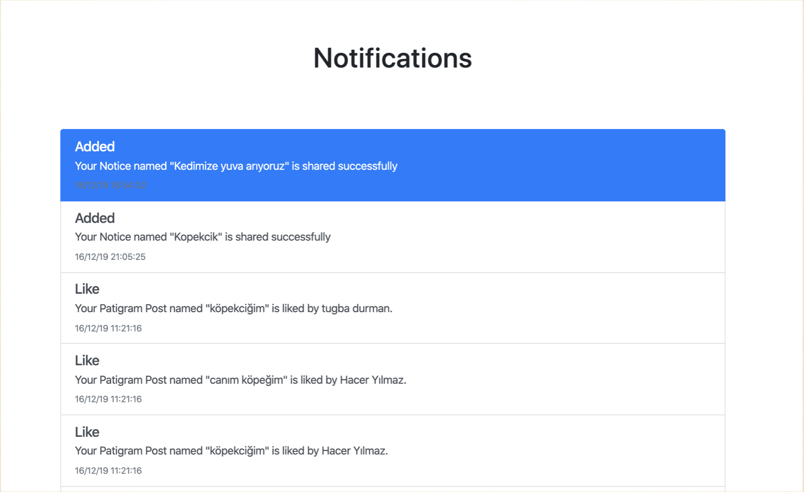

Parts Implemented by Alperen Cesur
===================================

Login page, register page, authentication operations, notifications, notices and profile page are implemented by Alperen Cesur.

User Registration Page
----------------------------

     Figure 1: Register page

This page is used to register user to PetWorld website. User has to write email, password, name and surname. Email has to never used in the system before.
After that password will be hashed and the informations are saved to Database.
Also user can write their Facebook,Twitter,Instagram, Youtube and website link.
Under the social media links text box, there is a checkbox which is define user's title, is veterinary or not.
Finally user select an avatar and submit their informations. Email is checked after push the button, if it is didn't use, user is directed to login page. If not, user has to write different email address to register.

Login Page
---------------------------

.. figure:: images/alperen/login.png
     :scale: 100 %
     :alt: login page

     Figure 2: Login page

This page is used to login of the user to website. User has to fill email and password and push the submit button. After the written informations are checked with the information from database. Firstly email checked is it used and after that password are compared. If the email and password is true, user is directed to home page. Also user can go register page with sign up button.

Notices Page
-----------------

     Figure 3: Lost notices page

In this page users can share notice about pet. Notices can be divided two parts; Lost and get adopt notices. Lost notices are about Lost pets. If the pet is lost, people share their information Lost pet.

     Figure 4: Find notices page

Get adopt notices are about pets which are searching new Home. In the main page, users can see the notices image, place, and shared time.

     Figure 5: Notice detail page

The details of the notices are can be seen after the pushed Go Details button. In details, creator's name and surname , gender, age, strain and contact of owner. User can be update their notice's title with pushing update your notice button.

     Figure 6: Notice add page

In the notice add page, user add page, age, strain, gender, contact information etc. Also user select the type of notice and submit it.

Profile Page
-------------

     Figure 7: Profile page

In this page, the details of the user can be seen. User's name and surname, title ( veterinary or pet owner), e-mail adress, website adress, register date, and social media address links.

     Figure 8: Avatar changing page

If the user clicked to '' change your avatar '' button, user can change the avatar. Also user can delete the account with ''Delete account'' button.

.. figure:: images/alperen/other.png
     :scale: 100 %
     :alt: Another user's profile page

     Figure 8: Another user's profile page

Also from Patigram page, user can click to other user's name and see their profile page and their information.

Notifications
---------------

     Figure 9: Notifications page

In this page, the user can see their notifications about him/her shared posts, notices and blogs. Notifications have title and description. Titles are "added", "deleted", "Like" , "Comment". Description has the information about notifications, post name and owner of activity and time of notification. If the notification is new, user see is firstly, notification is seen in blue. If the notification type is comment, comment can also seen.


