Parts Implemented by Bengisu Almıla Pınar
================================
FindVet and Patigram related pages are implemented. In addition, navbar of logined user is implemented except a few alterations. In patigram page, every user can share photos about animal in this page ; moreover, they can make comment and like the photos they want. In findVet page, users can find veterinaries near them, they can rate or see the evaluations of vets to find the best choice for their pets.

Patigram Home Page
-----------------------------

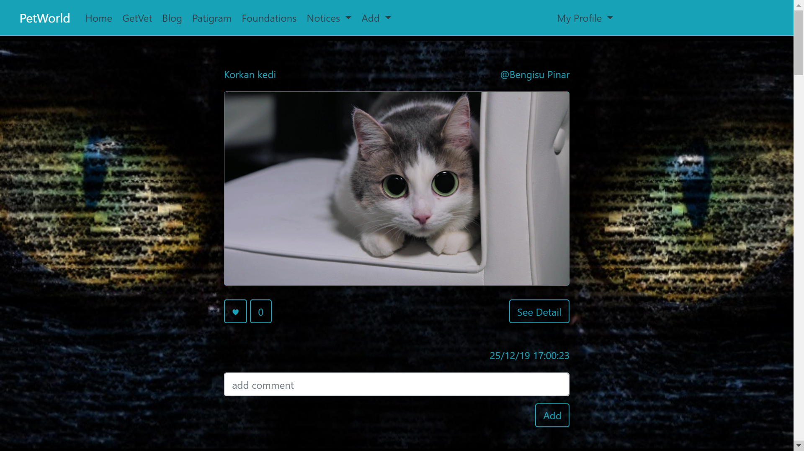

     Figure 1: Patigram home page

In this page users can see all posts lined up by date. Title, owner, date and like number of a post can be seen. Every user can make comment about post with "Add" button, then they will be directed to the post's custom page. "See Detail" button is used for passing detail page of that post. Button with the heart shape can be used for liking the post or withdrawing like from the post.

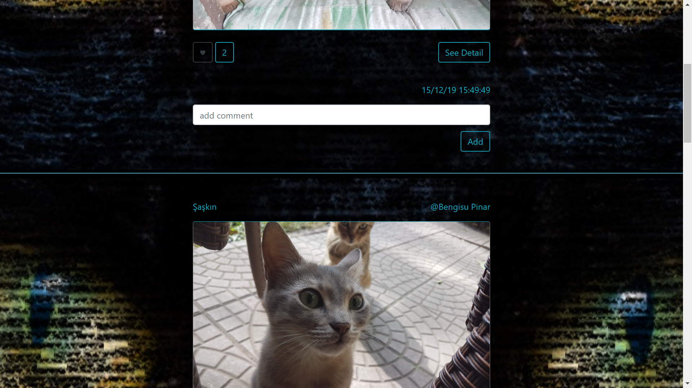

     Figure 2: Liked Button

If logined user has already liked a post, like button of that post will be colored to grey like in figure 2. Button's color will be converted to the blue when the like is withdrawn.

Patigram Detail Page
-----------------------------
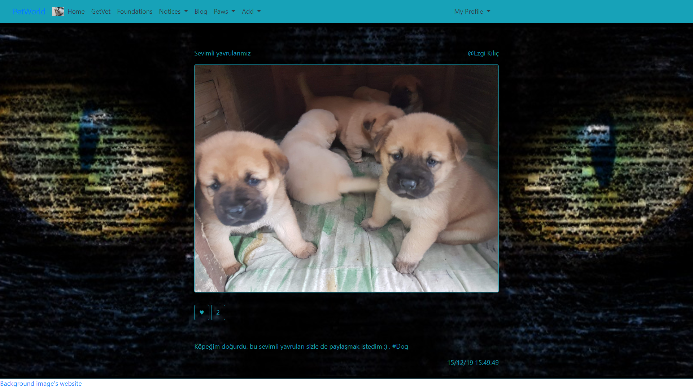

     Figure 3: Detail Page of Patigram

Every post has a detail page. Detail page consists of comments and description of post, if there is, in addition to the home page.

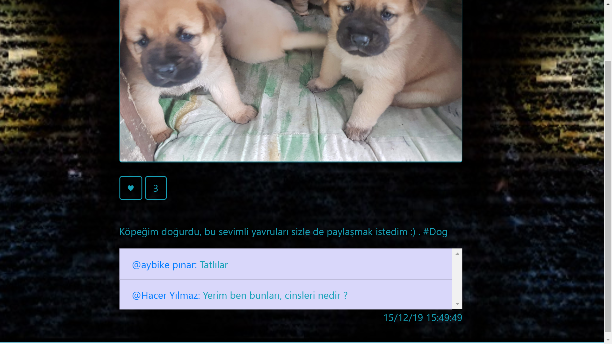

     Figure 4: Comments of a post

All comments can be displayed by scrolling mouse in the comment item as can be seen from figure 4.

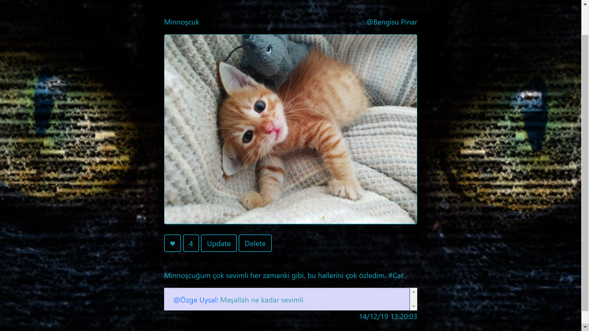

     Figure 5: Delete and Update buttons

If the user is the owner of the displayed post in detail page, update and delete buttons which can be seen in figure 5 will be appeared. Users can delete that post or directed to the update page.

Patigram Update Page
-----------------------------

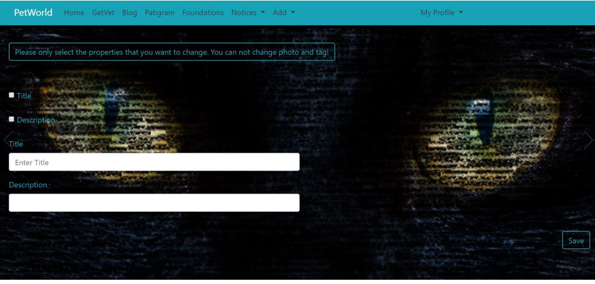

     Figure 6: Update page

    Users can change description and title of their posts. They have to be mark checkboxes which they want to change then save it. For example if a user live title empty, title won't be change even the user type some text to title's text area.

Patigram Add Page
-----------------------------

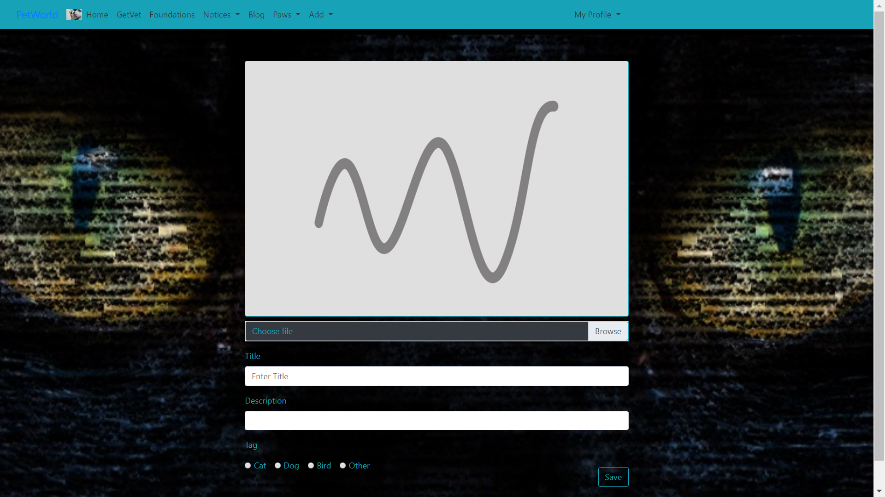

     Figure 7: Post Add page

Users can reach this page via navbar-> Add -> Patigram. Every user can share a post, but title and image are compulsory to share post.

FindVet  Home Page
-----------------------------

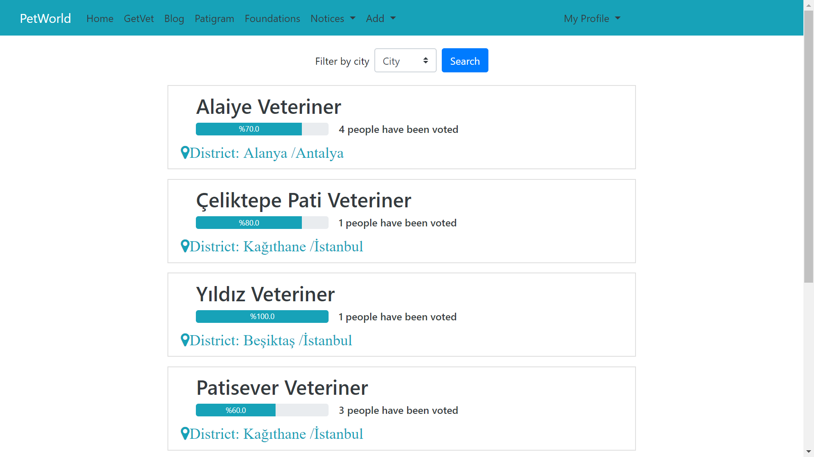

    Figure 8: FindVet Home page

In this page, users can see all veterinaries. A  veterinary's name, city, district, number of votes and overall score can be seen in here.

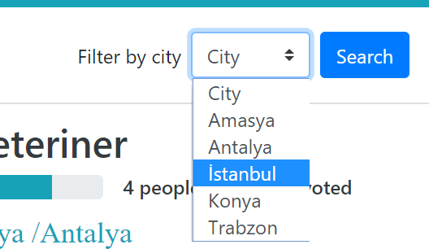

     Figure 9: FindVet filter

As can be seen from figure 9, veterinaries can be filter by city, the wiev will be same as home page only veterinary number will be change in the page. Users can reach to detail page by clicking to the vet.

FindVet Detail Page
-----------------------------

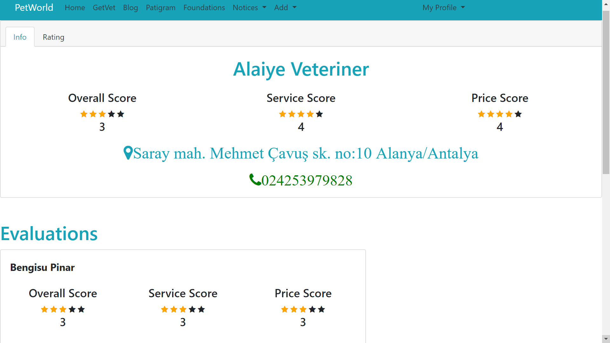

     Figure 10: Veterinary detail page

This page involves more informations about veterinary, such as telephone number, detailed address, three scores which are service, price and overall score.

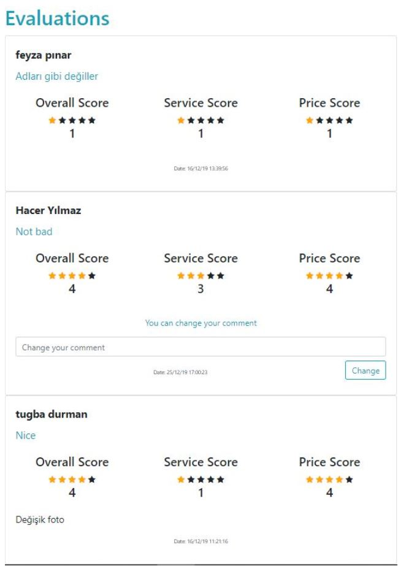

     Figure 11: Vet evaluations

In the bottom of the page, all evaluations made by users can be seen. Evaluations are ordered by date; therefore it will be more clear in case of that veterinary changes service quality. If current user has rating of that veterinary, a text input will be appear on the evaluation which enables users to change their comment. Users will be directed to the rating add page if they click "Rating" button which is shown figure 10.

findVet Add Rating Page
-----------------------------

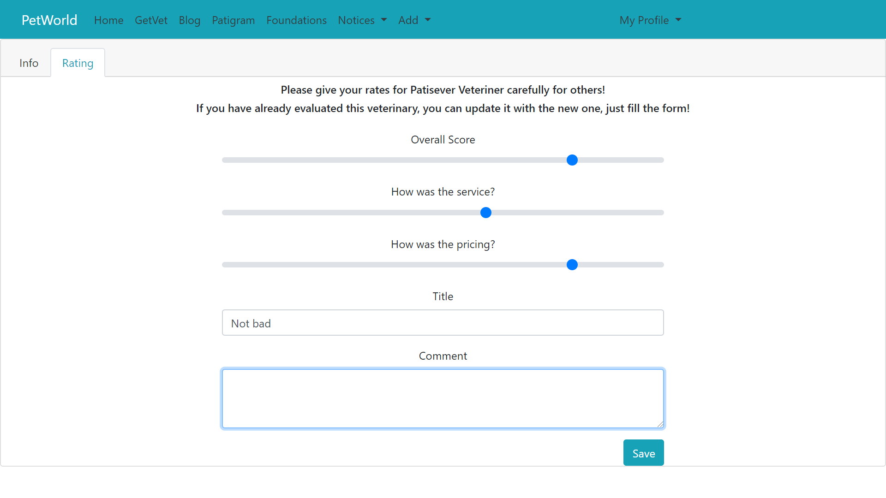

     Figure 12: Add rating

Users can evaluate a veterinary from this page. The are three type scores which are price, overall and service for understanding the quality of vet clearly. Title and description can be appended to explaine anything users wants. If a user has already created rating to that vet, old rating will be deleted and new one will be inserted.
